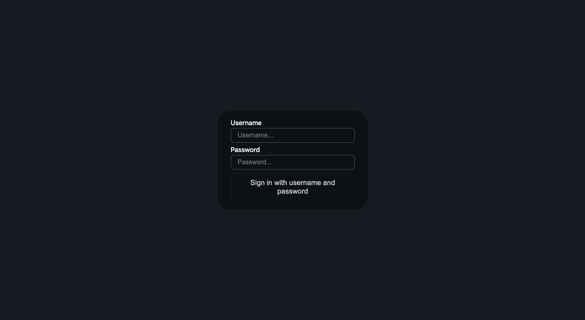
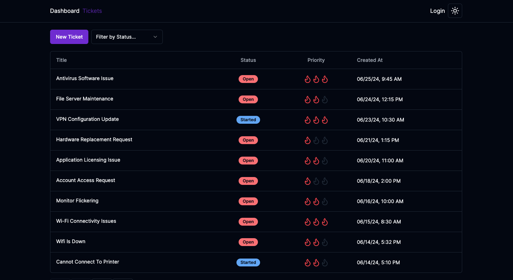
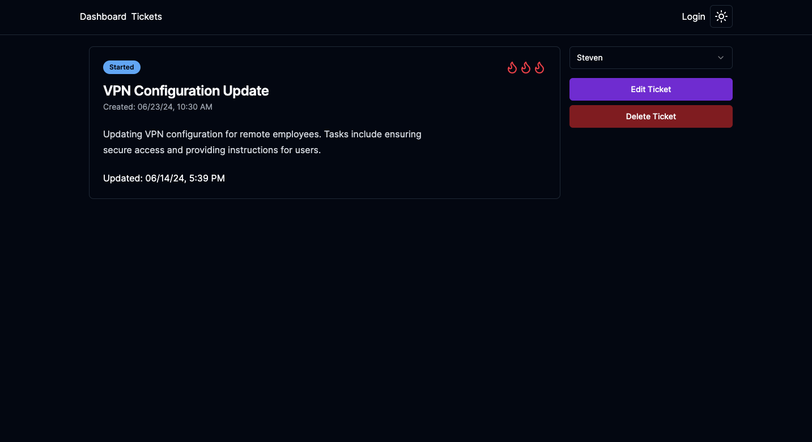
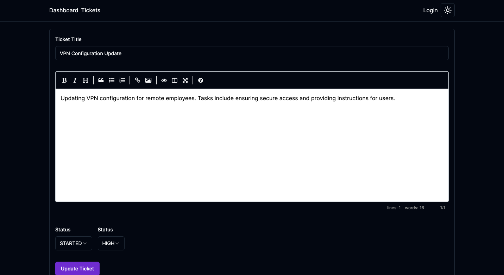
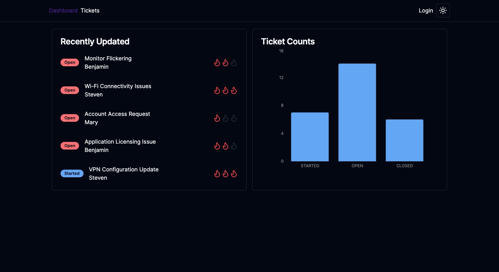

# Ticket Manager App
## _A modern internal support ticketing system for teams_

This ticket management tool is designed for IT departments and operations teams to track and prioritize internal issues. Users can log in, create new tickets, update ticket details, and monitor resolution progress—all within a clean and responsive dashboard interface.

## Live Demo

[TicketApp - Live Demo](https://nextjs-ticket-application.vercel.app/)

## Screenshots

**Login View**

**Ticket List View**

**Ticket Detail View**

**Edit Ticket View**

**Dashboard Overview**

## Features

- Secure user authentication
- Create, update, and delete support tickets
- Assign ticket priority and track progress with status updates
- View recent activity and ticket counts in a visual dashboard
- Filter tickets by status or assigned user
- Fully responsive design with dark mode support

This app replicates functionality commonly found in enterprise ticketing systems like JIRA or ServiceNow, tailored for internal use with simplified workflows.

## Tech

Ticket Manager App is built using:

- Next.js
- React
- TypeScript
- Firebase (Authentication + Firestore Database)
- Tailwind CSS
- Vercel (Deployment)

## Acknowledgements

This project was built as a full-stack demonstration of real-time data handling, authentication, and admin-style dashboards using the modern Next.js ecosystem.
